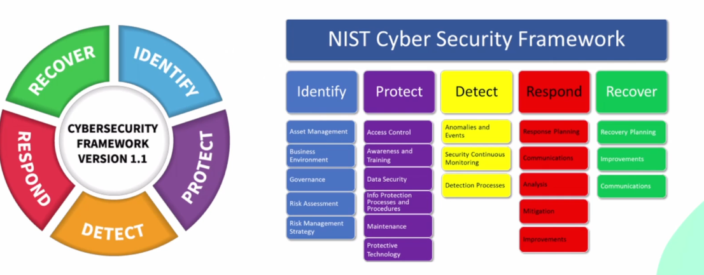

# Ciberseguridad

- Práctica de proteger la infraestructura tecnológica (sistemas, redes, aplicaciones, datos) de posibles amenazas digitales.
- Las organizaciones tienen la responsabilidades de proteger su infraestructura y cumplir diferentes normativas.

## Abordar la ciberseguridad

- NIST Cyber Security Framework
- 
- NIST: Instituo nacional de estándares y tecnología
- Subdominios:
  - Identificación
  - Protección
  - Detección
  - Respuesta
  - Recuperación

## Blue team VS Red team VS Purple teams

- Blue team: Orientado a ciberseguridad defensiva.
- Red team: Orientado a ciberseguridad ofensiva. Probar la eficacia de las medidas de seguridad implementadas por el blue team.
- Purple team: Combina los roles de red team y blue team.
