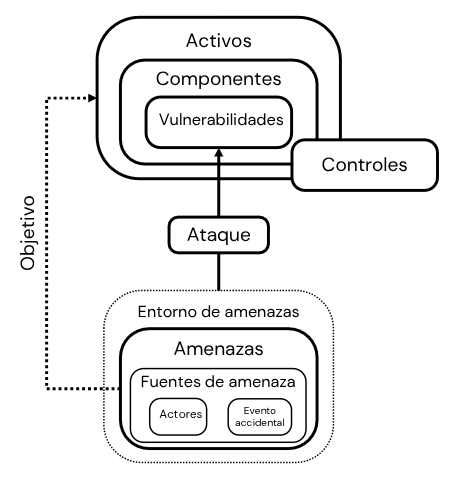

# Amenaza, ataque y vulnerabilidad

- Amenaza:
  - Cualquier circunstancia o evento con el potencial de afectar negativamente las operaciones, activos o individuos de una organización. Todo aquello que nos puede afectar.
  - Fuentes de ataque: Actores o eventos accidentales.
  - El objetivo son los activos de la organización.
- Vulnerabilidad: Fallo o debilidad en los procedimientos de seguridad en los sistemas de información, diseño, implementación o controloes internos que podrían explotarse accidental o intencionadamente.
- Ataque: Mecanismo en el que una amenza explota una vulnerabilidad.
