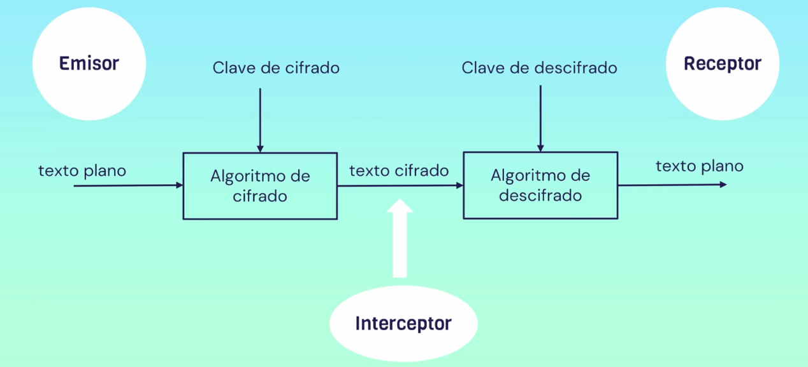

# Introducción a la criptografía

- Es la práctica y el estudio de técnicas que permiten garantizar la confidencialidad, integridad, autenticación y no repudio de la información que se encuentra almacenada, en tránsito o en uso.

## Criptosistema

- Conjunto de elementos criptográficos para implementar un conjunto de seguridad completo.
- Ej: Transformar un texto plano en un texto cifrado.
- Elementos fundamentales:
  - Text plano: Datos brutos, mensaje original que debe protegerse durante la transmision del emisor al receptor. Denominado tambien como texto en claro o mensaje.
  - Elementos criptograficos:
    - Algoritmo de cifrado: serie de operaciones que toman como entrada el texto plano y una clave de cifrado y dan como resultado el texto cifrado. Debe ser acordado previamente entre emisor y receptor.
    - Clave de cifrado: elemento que conoce el emisor y que se propone al algoritmo de  cifrado para generar el texto cifrado.
    - Texto cifrado: formato que no se puede leer del texto plano.
    - Algoritmo de descifrado: conjunto de operaciones que reciben como entrada el texto cifrado y una clave de descifrado y producen el texto plano.
    - Clave de descifrado: valor que conoce el receptor que nunca debe ser conocida por el interceptor
- Partes:
  - Emisor: Individuo que tiene el texto otiginal y que quiere trasnmitirlo a un receptor..
  - Interceptor: adversario o atacante. Entidad distinta al emisor y receptor que quiere acceder al mensaje.
