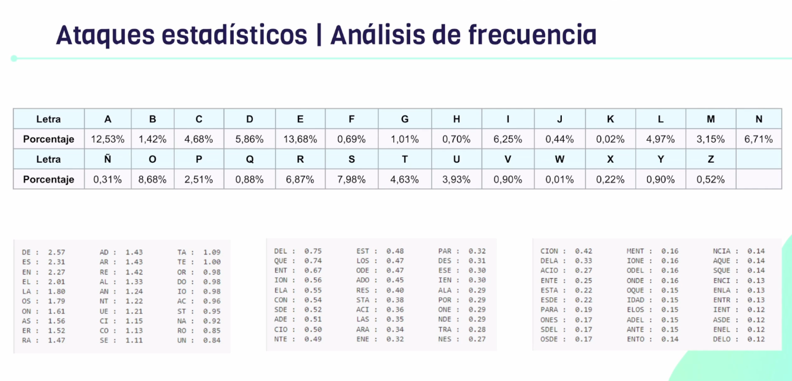

# Ataques estadisticos

- Cuando escribimos texto, la combinacion de letras no es arbitraria. La frecuencia de las letras estan mas o menos determinadas.
- 
- Una letra del texto plano siempre se corresponde a una letra del texto cifrado. La frecuencia se mantiene.
- Bigramas, trigramas, cuatrigramas de combinacion de letras que mas se repiten.
